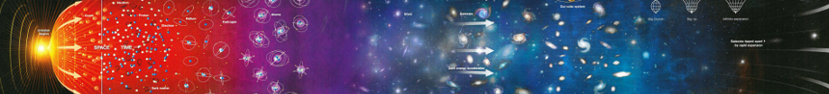

# Introducción a Partículas, Astrofísica y Cosmología - Segundo semestre de 2017

**Asignatura del séptimo semestre de la carrera de Profesorado en Física [Universidad Nacional de Río Negro](http://www.unrn.edu.ar/ "UNRN")**

Las clases fueron realizados en [LibreOffice Impress](https://es.libreoffice.org/descubre/impress/), la herramienta de presentaciones de [LibreOffice](https://es.libreoffice.org/). Para poder visualizar correctamente las clases, por favor descarguelo siguiendo el este enlace: **[Descargue LibreOffice](https://es.libreoffice.org/descarga/libreoffice-estable/)**. En Windows, puede ser necesario descargar también la fuente [Cabin](https://www.fontsquirrel.com/fonts/download/cabin). Para facilitar la difusión, se incluyen también versiones de las clases en formato pdf. Para visualizarlo, podría necesitar descargar [Acrobat Reader](https://get.adobe.com/es/reader).

# Objetivo

Adquirir una perspectiva del estado actual de la Física de Partículas, la Astrofísica y la Cosmología, a un nivel introductorio y que produzca las herramientas para su implementación en el aula de escuelas medias.

# Contenidos mínimos

Los contenidos mínimos establecidos por el Plan de Estudios de la carrera para este curso son los siguientes: 

*Estrellas y galaxias. Evolución de las estrellas nacimiento y muerte de las estrellas. Relatividad general: gravedad y la curvatura del espacio. El universo en expansión. El Big-Bang y el fondo cósmico de microondas. El modelo estándar cosmológico. Los primeros tiempos del universo* 

# Programa

## Primer módulo
**Del Martes 08 de Agosto al Martes 03 de Octubre (primer parcial)**

### [Unidad 1: Todo es relativo](clases/u01)
**4 encuentros: desde el Martes 08/Ago al Martes 29/Ago**

Relatividad Especial. Introducción. Cinemática y Dinámica Relativista. Física de Partículas (1ra parte). Radiactividad. Planck, Bosones y Fermiones. Interacciones fundamentales.

### [Unidad 2: Calido y Frío](clases/u02)
**5 encuentros desde el Martes 05/Sep al Martes 03/Oct**

Estrellas. Astronomía Observacional: sistemas de coordenadas y mapas estelares. Radiación de Cuerpo Negro. Ley de Eddington, Clasificación estelar, Diagrama H-R. Objetos Compactos y evolución estelar. Planetas. Planetas y Exoplanetas. Vida en el Universo: Astrobiología. Galaxias. Modelos y formación. Ejemplos: La Vía Láctea, Otras Galaxias, GalaxyZoo

## Segundo módulo
**Del Martes 04/Oct al Martes 21/Nov (segundo parcial)**

### [Unidad 3: No es lo que se ve, sino lo que se palpa](clases/u03)
**4 encuentros desde el Martes 10/Oct al Martes 31/Oct**

Relatividad General. Introducción y conceptos básicos. Modelo de Friedman-Lemaître-Robertson-Walker. El error de Einstein. Modelos del Universo. Formación de estructuras. Midiendo distancias. Corrimiento al rojo. El universo en expansión

### [Unidad 4: Allá lejos y hace tiempo](clases/u04)
**3 encuentros desde el Martes 07/Nov al Martes 21/Nov**

El modelo cosmológico estándar. Modelo de Alpher, Bethe & Gamow. El fondo de microondas. Modelo LCDM. Historia térmica del universo. El Big Bang. Primeros segundos del universo. Épocas térmicas de tiempo, inflación, recombinación. Evolución futura del universo. ¿El fin...?

## Bibliografía obligatoria y complementaria

* An Introduction to Modern Astrophysics; Carrol Bradley and Ostille Dale; 2nd Edition; Addison Wesley; 2006; ISBN 978-0805304022
* El Significado de la Relatividad; Albert Einstein; S.L.U. Espasa; 1921; ISBN 9788467029710
* Física Universitaria Vol 2, Cap 37; Hugh Young y Roger Freedman (Sears y Semansky); 13ma Edición; Addison Wesley; 2015; ISBN 9786073221245
* The Nature of Space and Time; Stephen Hawkings and Roger Penrose; Princeton University Press; 2010; ASIN: B003VPWWC0
* Breve historia del tiempo; Stephen Hawkings; Paidos; 1988; ISBN 9786079377373
* Física de las noches estrelladas: Astrofísica, Relatividad y Cosmología; Eduardo Battaner; Tusquets Editores; 2011; ISBN: 9788483833421
* Qué es la vida?; Erwin Schrödinger; Salamanca; 2005.

#### (C) 2016 ... - Hernán Asorey ([@asoreyh](https://twitter.com/asoreyh/))

 Este trabajo se distribuye en forma gratuita bajo la <a rel="license" href="http://creativecommons.org/licenses/by-nc-sa/4.0/">Licencia Creative Commons Attribution-NonCommercial-ShareAlike 4.0 International</a>.
